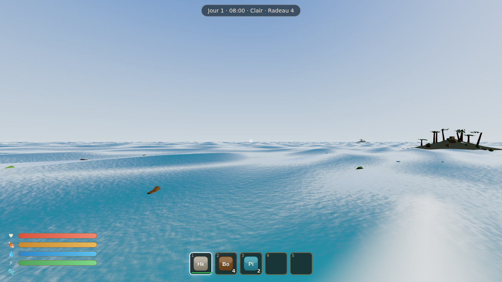

# 🌊 DRIFTWAKE — Survie maritime

> Vous vous réveillez à la dérive sur un radeau de fortune, au milieu d'un océan sans
> fin. Récupérez les débris qui flottent, agrandissez votre embarcation, gérez votre
> faim et votre soif, repoussez le requin, atteignez les îles… et survivez.

**DRIFTWAKE** est un jeu de survie maritime 3D **original**, jouable dans un navigateur
moderne. Il s'inspire des mécaniques générales du genre (survie sur radeau) mais
n'emprunte **aucun** asset, code, nom, modèle, texture, son ou interface à un jeu
existant. Tous les visuels et sons sont **générés de façon procédurale** au moment de
l'exécution (géométrie par code, textures via canvas 2D, audio via la Web Audio API).



---

## ✨ Présentation

- **Océan réaliste** : vagues de Gerstner (déplacement de sommets sur GPU), écume sur les
  crêtes, réflexion du ciel, fresnel, couleur selon la profondeur, normal maps de détail,
  brouillard atmosphérique. La **même formule de vagues** pilote le shader (GPU) et la
  flottabilité (CPU), donc le radeau et les objets suivent exactement la surface visible.
- **Cycle jour/nuit** complet : lever/coucher de soleil, lune, étoiles procédurales,
  couleurs de ciel et intensités lumineuses qui évoluent dans le temps.
- **Météo dynamique** : clair → nuageux → pluie → tempête, avec pluie en particules,
  vent, éclairs, mer plus agitée et brouillard variable.
- **Radeau modulaire** sur grille : fondations, murs, piliers, plancher, coffres, grill,
  purificateur d'eau, jardinière, filet, table de recherche… avec aperçu holographique
  vert/rouge, rotation, coût en matériaux, démolition et réparation.
- **Crochet de récupération** : maintenir pour charger, lancer balistique, corde visible,
  rembobinage automatique des débris.
- **Survie** : santé, faim, soif, endurance, oxygène (en plongée), température.
- **Requin** réaliste piloté par une machine à états (Patrol, CircleRaft, ChasePlayer,
  BitePlayer, AttackRaft, Flee, Stunned, Dead…) avec attaque télégraphiée.
- **Îles procédurales déterministes** (seed) : plage de sable, palmiers et rochers
  récoltables, buissons instanciés, coffre à butin.
- **Pêche**, **cuisine** (grill), **purification d'eau**, **agriculture** (jardinières),
  **artisanat** et **recherche**.
- **Sauvegarde** complète via IndexedDB (emplacements multiples, autosave, export/import).
- **4 préréglages graphiques** (Faible / Moyen / Élevé / Ultra) qui modifient réellement
  résolution, ombres, distance d'affichage, densité de particules, post-traitement, LOD.

---

## 🚀 Installation & lancement

Prérequis : **Node.js ≥ 18** (testé sous Node 22) et npm.

```bash
npm install
npm run dev      # serveur de développement → ouvre http://localhost:5173
```

> ⚠️ **Ne double-cliquez pas `index.html`** (ni `dist/index.html` du build classique).
> C'est une application Vite : les navigateurs **bloquent** le chargement des modules
> JS/CSS en `file://` (politique CORS) → **page blanche**. Il faut passer par un serveur.

Build de production servi sur HTTP :

```bash
npm run build    # vérifie les types puis bundle dans dist/ (chemins relatifs)
npm run preview  # sert le build sur http://localhost:4173
```

### 🖱️ Version « double-cliquable » (un seul fichier, sans serveur)

Pour obtenir un **unique `dist/index.html` autonome** (JS + CSS inlinés) qui s'ouvre
directement par double-clic, sans aucun serveur :

```bash
npm run build:single   # → dist/index.html autonome (~700 kB)
```

Ouvrez ensuite `dist/index.html` dans le navigateur (double-clic ou glisser-déposer). Ce
mode a été vérifié en `file://` (rendu WebGL + nouvelle partie OK, aucune erreur console).

---

## 🧰 Commandes npm

| Commande              | Rôle                                                        |
| --------------------- | ----------------------------------------------------------- |
| `npm run dev`         | Serveur de développement Vite (HMR)                         |
| `npm run build`       | `tsc --noEmit` + bundle de production Vite                  |
| `npm run preview`     | Sert le build de production                                 |
| `npm run typecheck`   | Vérification stricte des types TypeScript                   |
| `npm test`            | Tests unitaires Vitest (39 tests)                           |
| `npm run test:watch`  | Tests en mode watch                                         |
| `npm run lint`        | ESLint (0 warning toléré)                                   |
| `npm run format`      | Formatage Prettier                                          |
| `npm run smoke`       | Test de fumée headless (voir ci-dessous)                    |

### Test de fumée navigateur (optionnel)

Un test end-to-end **réel** charge le jeu dans Chromium (WebGL via SwiftShader), démarre
une partie, exerce les entrées et échoue sur toute erreur console. Il nécessite Playwright :

```bash
npx playwright install chromium
npm run build && npm run preview &   # serveur sur :4173
npm run smoke                        # capture scripts/smoke*.png
```

---

## 🏗 Architecture (résumé)

Code **modulaire, typé, orienté composants**, avec séparation logique / rendu, données
centralisées, object pooling et événements typés. Voir [`ARCHITECTURE.md`](ARCHITECTURE.md).

```
src/
  core/        Engine (Game), EventBus, Input, Audio, Save, Settings, RNG
  rendering/   Renderer, Sky, PostProcessing, Materials, TextureFactory, shaders/
  world/       Ocean (Gerstner), DayNight, Weather, Islands, FloatingDebris
  player/      PlayerController (FPS + nage), PlayerStats (survie)
  raft/        RaftManager, BuildingGrid (logique pure), BuildingSystem, RaftMeshes
  entities/    Shark + SharkModel, resources/
  ai/          StateMachine générique
  inventory/   Inventory, ItemDatabase
  crafting/    RecipeDatabase, CraftingSystem (+ recherche)
  systems/     Hook, Fishing, Combat, Processing (grill/purificateur), Interaction
  ui/          MainMenu, HUD, InventoryScreen, Menus, IconFactory
  tests/       Tests Vitest
```

---

## 🎮 Contrôles

ZQSD **et** WASD pris en charge. Détails et reconfiguration : [`CONTROLS.md`](CONTROLS.md).

| Action            | Touche            | Action               | Touche               |
| ----------------- | ----------------- | -------------------- | -------------------- |
| Déplacement       | W A S D / Z Q S D | Interagir            | E                    |
| Regarder          | Souris            | Inventaire           | Tab                  |
| Utiliser / frapper | Clic gauche      | Construction         | B                    |
| Action secondaire | Clic droit        | Pivoter (build)      | R                    |
| Sprint            | Maj               | Barre rapide         | 1–5 / molette        |
| S'accroupir/plonger | Ctrl            | Menu / Pause         | Échap                |
| Sauter / remonter | Espace            |                      |                      |

Les touches sont **reconfigurables** dans Paramètres.

---

## ✅ Fonctionnalités terminées (vertical slice + au‑delà)

Les **20 critères de validation** de la première version jouable sont remplis :

1. ✅ Lancer une nouvelle partie · 2. ✅ Apparaître sur un radeau · 3. ✅ Se déplacer/regarder ·
4. ✅ Océan animé · 5. ✅ Ressources flottantes · 6. ✅ Lancer le crochet ·
7. ✅ Récupérer bois & plastique · 8. ✅ Ouvrir l'inventaire · 9. ✅ Fabriquer un marteau ·
10. ✅ Agrandir le radeau · 11. ✅ Gérer faim/soif · 12. ✅ Récupérer de l'eau salée ·
13. ✅ Purifier et boire · 14. ✅ Cuire et manger un poisson · 15. ✅ Subir le requin ·
16. ✅ Repousser le requin à la lance · 17. ✅ Atteindre une île · 18. ✅ Couper un arbre ·
19. ✅ Sauvegarder · 20. ✅ Recharger exactement la même partie.

S'ajoutent : météo & tempêtes, cycle jour/nuit, recherche, agriculture, pêche, coffres,
4 préréglages graphiques, post-traitement (bloom/SMAA), audio procédural spatialisable,
HUD complet, menus, et un test de fumée navigateur.

## 🚧 Fonctionnalités restantes / pistes d'amélioration

- Navigation active (voile/gouvernail/moteur) : le radeau est actuellement **ancré** (bob
  + tilt sur les vagues) ; les pièces et l'énergie sont prévues mais la propulsion n'est
  pas encore branchée.
- Modèles glTF importés (le jeu utilise des placeholders procéduraux propres — voir
  [`ASSETS.md`](ASSETS.md) pour la procédure de remplacement).
- Caustiques sous-marines et SSR complets (approximés actuellement).
- Behavior tree pour des animaux d'île plus variés.
- Multi-étages avancés et stabilité structurelle physique.

## 🐞 Problèmes connus

- **Page blanche ?** Vous avez probablement ouvert `index.html` en `file://`. Lancez
  `npm run dev`, ou générez la version autonome avec `npm run build:single` puis ouvrez
  `dist/index.html`.
- Le **Pointer Lock** nécessite un clic dans la fenêtre (politique navigateur). Si le
  curseur ne se verrouille pas, cliquez sur la scène.
- L'**audio** ne démarre qu'après la première interaction utilisateur (autoplay policy).
- En **headless / SwiftShader**, le rendu fonctionne mais reste plus lent qu'avec un GPU.
- Le requin peut occasionnellement passer près d'un bord d'île à grande vitesse lors
  d'une charge (l'évitement est désactivé pendant les attaques, par conception).

---

## 📜 Licences & crédits

- **Code** : original, écrit pour ce projet.
- **Three.js** — MIT License (https://github.com/mrdoob/three.js).
- **Assets** (modèles, textures, icônes, sons) : **100 % générés de façon procédurale au
  runtime** par le projet lui‑même → aucune licence tierce, aucun fichier importé. Détail
  exhaustif dans [`ASSETS.md`](ASSETS.md).

Voir aussi [`GAME_DESIGN.md`](GAME_DESIGN.md), [`PERFORMANCE.md`](PERFORMANCE.md) et
[`CHANGELOG.md`](CHANGELOG.md).
