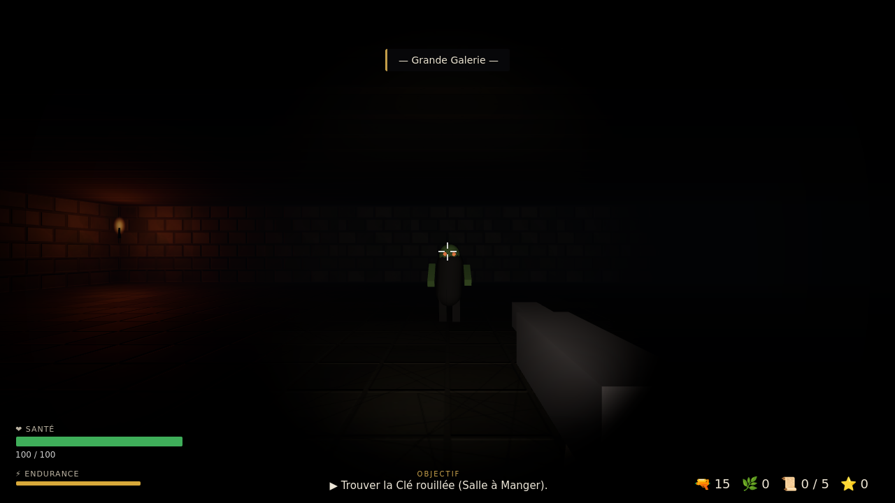
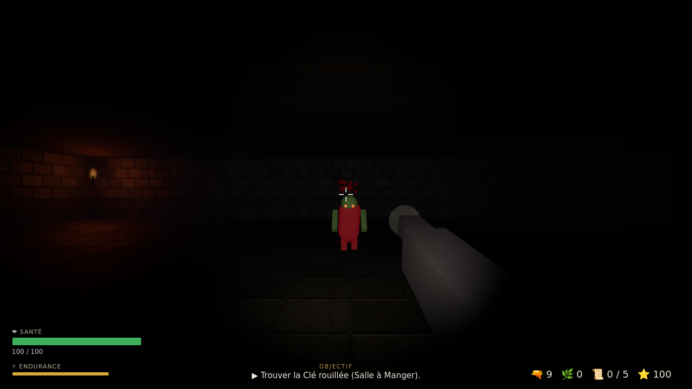

# 🏰 Château Maudit — Survival Horror 3D

Un clone de *Resident Evil* jouable dans le navigateur : un **château hanté en 3D à la
première personne**, avec monstres, combat, énigmes de clés/portes, inventaire, documents
à lire et un système de **quêtes**. Réalisé en **Three.js** (WebGL), sans aucun build :
il suffit d'ouvrir `index.html`.




## ▶️ Lancer le jeu

- **Le plus simple :** double-cliquez sur `index.html` (tout fonctionne hors-ligne,
  Three.js est embarqué dans `vendor/`).
- **Ou via un petit serveur local** (recommandé si votre navigateur bloque les fichiers
  locaux) :
  ```bash
  python3 -m http.server 8000
  # puis ouvrez http://localhost:8000
  ```

Cliquez sur **ENTRER DANS LE CHÂTEAU** : la souris est capturée (pointer lock).
Appuyez sur **Échap** pour libérer le curseur.

## 🎮 Commandes

| Action | Touche |
|---|---|
| Se déplacer | `ZQSD` / `WASD` / flèches |
| Regarder | Souris |
| Tirer | Clic gauche |
| Couteau (illimité) | Clic droit / `F` |
| Sprinter | `Maj` |
| Interagir (portes, documents) | `E` |
| Se soigner (herbe) | `H` |
| Lampe torche on/off | `L` |
| Inventaire | `I` / `Tab` |
| Pause | `Échap` |

## 🧟 Le jeu

Vous vous réveillez dans le **Hall d'Entrée** d'un château maudit composé de 9 salles
(galerie, salle à manger, bibliothèque, cour, armurerie, cachots, chapelle, laboratoire).
Les portes principales sont verrouillées. Il faut progresser pas à pas :

1. **Trouver la Clé rouillée** (Salle à Manger) pour ouvrir la **Bibliothèque**.
2. Y lire un document révélant l'emplacement de la **Clé du Laboratoire** (dans les Cachots).
3. Récupérer cette clé en survivant aux créatures.
4. Pénétrer dans le **Laboratoire** et **détruire Le Gardien** (boss).
5. Récupérer le **Sérum-G**, puis ouvrir la **Grande Porte** pour s'échapper.

Bonus : retrouvez les **5 documents** disséminés dans le château.

### Ennemis
- **Goule errante** — lente mais résistante.
- **Molosse du Cerbère** — rapide, attaque en meute.
- **Rampant** — robuste et lourd.
- **Le Gardien** (boss) — énorme, attaques à distance, entre en furie sous 35 % de PV.

### Mécaniques façon Resident Evil
- Munitions limitées (le couteau est votre secours), **herbes vertes** de soin.
- **Clés** et portes verrouillées qui structurent l'exploration.
- **Documents** narratifs donnant des indices.
- Ambiance horreur : obscurité, **brouillard**, **lampe torche** dynamique, torches
  murales vacillantes, sang et impacts.

## 🛠️ Aspect technique (réalisme)

- **3D temps réel** avec Three.js (`WebGLRenderer`, tone mapping ACES, ombres PCF douces).
- **Textures procédurales** générées au chargement (pierre, dalles, bois, plafond) avec
  **normal maps** et **roughness maps** dérivées de height maps → relief réaliste sous la
  lumière mobile.
- **Éclairage dynamique** : lampe torche (spot avec ombres portées), torches ponctuelles
  vacillantes (limitées aux plus proches pour les performances), brouillard exponentiel.
- **Monstres articulés** (corps, tête, membres animés, yeux émissifs) avec IA de poursuite
  et collisions sur grille.
- **Audio synthétisé** via Web Audio API (tirs, cris, portes, ambiance) — aucun fichier son.

## 📁 Structure

```
index.html            Page + overlays (HUD, menus, modales)
style.css             Thème horreur
vendor/three.min.js   Three.js (embarqué, hors-ligne)
js/
  config.js           Constantes, types de monstres et d'objets
  textures.js         Génération procédurale (color/normal/roughness)
  world3d.js          Plan du château, collisions, apparitions
  input3d.js          Entrées FPS (pointer lock, souris, clavier)
  player3d.js         Contrôleur joueur, lampe, arme, combat
  monsters3d.js       Modèles 3D, IA, animations des ennemis
  quests.js           Système d'objectifs/quêtes
  audio.js            Sons synthétisés (Web Audio)
  ui.js               HUD, inventaire, notes, viseur
  game3d.js           Scène, rendu, boucle, interactions
```

Bon courage pour survivre jusqu'à l'aube. 🌑
